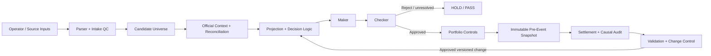

# Under The Line

[](https://github.com/nguyen0319/under-the-line/actions/workflows/docs-ci.yml)

**Status:** Launching September 2026 · Production source private · Walkthrough available on request

Under The Line is a governed MLB pitcher-prop research and operator platform built around reproducibility, evidence integrity, independent review, and controlled model evolution. **PP-LOOP** is the private engine that runs it; this public repository contains documentation, architecture, and redacted artifacts only.

## Built with

**Backend:** Python · FastAPI · PostgreSQL  
**Frontend / runtime:** Next.js · Docker · GitHub Actions

The audited corpus includes **15+ frozen slate snapshots and 1,100+ candidate prop rows**, with historical and prospective workflows exercised since July 2026.

## Architecture



### System layers

- **Ingestion and QC** — preserves raw inputs, validates schemas, rejects malformed or ambiguous records, and creates deterministic identities.
- **Reconciliation and analysis** — joins governed context such as role, workload, handedness, lineup, opponent, venue, and market information without allowing target leakage into pre-event decisions.
- **Decision controls** — separates analytical selection from independent review and portfolio/exposure checks.
- **Evidence** — freezes important inputs and outputs with SHA-256 identities so a prediction cannot be retrospectively rewritten after the event.
- **Settlement and validation** — keeps financial outcome separate from model-process outcome, records causal attribution, and routes proposed methodology changes through explicit validation.

## Maker / Checker boundary

The **Maker** produces the initial analytical decision. It evaluates both sides of an exact market, applies deployed rules, documents uncertainty, and proposes a disposition.

The **Checker** is deliberately separate. Its job is not to repeat the same prediction; it challenges the conditions that could make the Maker wrong or improperly governed: stale workload, incorrect role, lineup or handedness conflicts, weak evidence, unvalidated overlays, duplicated thesis exposure, shadow-feature leakage, correlation, or evidence-integrity failures.

That boundary exists because the process that creates a decision should not be the only process allowed to approve it. Independent review reduces confirmation bias, catches data and lifecycle failures that a statistically reasonable projection can hide, and creates a durable pre-event record of what was actually known. A Checker pass is still not a universal authorization: later stages remain separately gated.

## Redacted run output


The image above is a public rendering of a real governed verification result. Identifiers, private evidence paths, and internal implementation details are omitted.

## Sample redacted schema

```json
{
  "run_id": "run_<redacted>",
  "rules_version": "<redacted>",
  "candidate": {
    "market": "Pitching Outs",
    "line": 17.5,
    "evaluated_sides": {
      "over": { "modeled_probability": 0.46 },
      "under": { "modeled_probability": 0.54 }
    }
  },
  "maker": {
    "decision": "A",
    "side": "UNDER"
  },
  "checker": {
    "status": "PASS",
    "shadow_leakage": false,
    "evidence_integrity": "PASS"
  },
  "snapshot": {
    "frozen": true,
    "sha256": "<redacted>"
  },
  "placement": {
    "user_placed": false
  }
}
```

A machine-readable public example is available at [`docs/sample-run.schema.json`](docs/sample-run.schema.json). It is illustrative and intentionally smaller than the private production contracts.

## Change control

### Implemented and exercised

- versioned, hash-bound inputs and outputs;
- deterministic replay / reopen checks;
- independent Maker–Checker review;
- immutable pre-event evidence and explicit authority boundaries;
- official settlement with financial and causal outcomes kept separate;
- governed rule/process changes rather than silent in-place tuning.

### Specified and still being expanded

- broader automated walk-forward / out-of-fold evaluation across longer windows;
- standardized date-jackknife reporting;
- larger untouched holdout coverage;
- automated calibration reporting and promotion dashboards;
- formalized prospective shadow-to-production promotion criteria.

The distinction is intentional: implemented controls are described as implemented; planned validation work is not presented as completed evidence.

## License and contact

Public documentation and redacted artifacts are provided for portfolio and evaluation purposes. Production source, private datasets, credentials, and proprietary model details are not included.

See [`LICENSE`](LICENSE). For a technical walkthrough, open an issue in this repository or contact the repository owner through GitHub.
