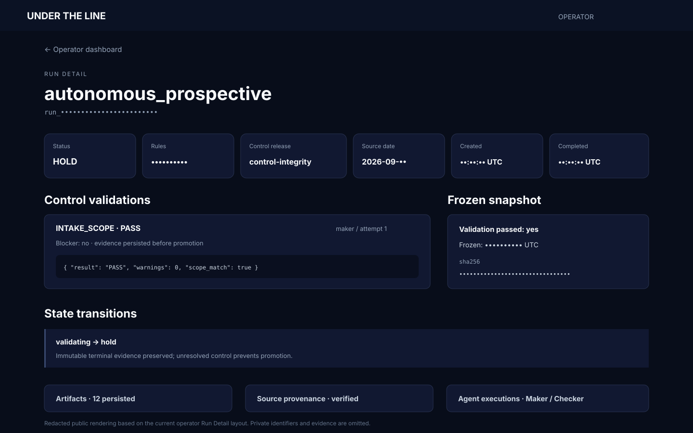
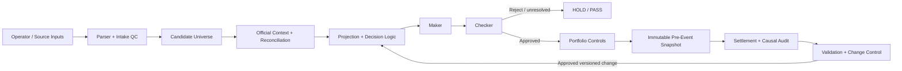

# Under The Line

[](https://github.com/nguyen0319/under-the-line/actions/workflows/docs-ci.yml)

**Status:** Launching September 2026 · Production source private · Walkthrough available on request

Under The Line is a governed MLB pitcher-prop research and operator platform built around reproducibility, evidence integrity, independent review, and controlled model evolution. **PP-LOOP** is the private engine that runs it; this public repository contains documentation, architecture, and redacted product artifacts only.

**Scale:** 15 frozen slates and roughly 1,100 candidate rows since July 2026.

## Built with

**Backend:** Python · FastAPI · PostgreSQL  
**Frontend / ops:** Next.js · TypeScript · Docker · GitHub Actions

## Operator view



Redacted public rendering based on the current operator Run Detail interface. Private identifiers, evidence paths, and implementation details are omitted; a live walkthrough is available on request.

## Architecture



### System layers

- **Ingestion and QC** preserves raw inputs, validates schemas, rejects malformed or ambiguous records, and creates deterministic identities.
- **Reconciliation and analysis** joins governed context such as role, workload, handedness, lineup, opponent, venue, and market information without allowing target leakage into pre-event decisions.
- **Decision controls** separate analytical selection from independent review and portfolio/exposure checks.
- **Evidence** freezes important inputs and outputs with SHA-256 identities so a prediction cannot be retrospectively rewritten after the event.
- **Settlement and validation** keep financial outcome separate from model-process outcome and route proposed methodology changes through explicit validation.

## Maker / Checker boundary

The **Maker** produces the initial analytical decision: it evaluates both sides of an exact market, applies deployed rules, documents uncertainty, and proposes a disposition.

The **Checker** is deliberately separate. It does not simply repeat the prediction; it challenges conditions that could make the Maker wrong or improperly governed, including stale workload, incorrect role, lineup or handedness conflicts, weak evidence, unvalidated overlays, duplicated thesis exposure, shadow-feature leakage, correlation, and evidence-integrity failures.

The boundary exists because the process that creates a decision should not be the only process allowed to approve it. Independent review reduces confirmation bias, catches data and lifecycle failures that a reasonable projection can hide, and creates a durable pre-event record of what was actually known. A Checker pass still does not authorize every later stage; promotion remains separately gated.

## Sample redacted schema

```json
{
  "run_id": "run_<redacted>",
  "candidate": {
    "market": "Pitching Outs",
    "line": 17.5,
    "evaluated_sides": {
      "over": { "modeled_probability": 0.46 },
      "under": { "modeled_probability": 0.54 }
    }
  },
  "maker": { "decision": "A", "side": "UNDER" },
  "checker": {
    "status": "PASS",
    "shadow_leakage": false,
    "evidence_integrity": "PASS"
  },
  "snapshot": { "frozen": true, "sha256": "<redacted>" }
}
```

A machine-readable public example is available at [`docs/sample-run.schema.json`](docs/sample-run.schema.json). It is intentionally smaller than the private production contracts.

## Change control

### Implemented and exercised

- versioned, hash-bound inputs and outputs;
- deterministic replay and reopen checks;
- independent Maker–Checker review;
- immutable pre-event evidence and explicit authority boundaries;
- official settlement with financial and causal outcomes kept separate.

### Specified and still being expanded

- broader automated walk-forward / out-of-fold evaluation across longer windows;
- standardized date-jackknife and calibration reporting;
- larger untouched holdout coverage and formalized shadow-to-production promotion criteria.

The distinction is intentional: implemented controls are described as implemented; planned validation work is not presented as completed evidence.

## Contact

For a technical walkthrough or architecture discussion, email **[nguyen.jimmy.2898@gmail.com](mailto:nguyen.jimmy.2898@gmail.com)**.

Public documentation and redacted artifacts are provided for portfolio and evaluation purposes. Production source, private datasets, credentials, and proprietary model details are not included. See [`LICENSE`](LICENSE).
